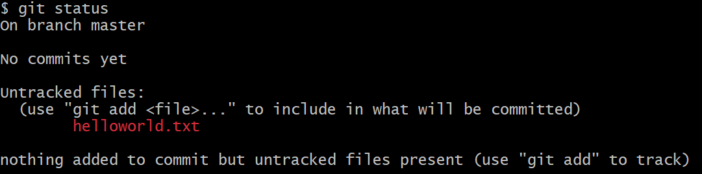
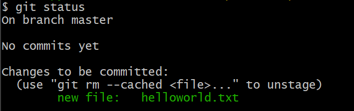
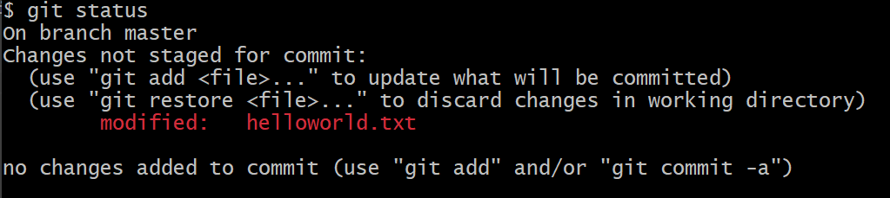

# 第四章 Hello World

本章我们简单使用下 git, 对版本变化和管理有个初印象。

在 Windows 下请打开 Git Bash, 在 MacOS 或 Linux 下打开任意 Terminal 即可。

## 1. Git 最低设置

Git 安装好后需要设置用户的名字和 email

```plaintext
$ git config --global user.name "Cao Yi"
$ git config --global user.email "iridiumcao@gmail.com"
```

Git 的更多设置会在[第十五章](15.md)介绍，这里仅仅需要设置这两个项。

## 2. Create a git repository

```plaintext
$ mkdir test_repo
$ cd test_repo/
$ git init
Initialized empty Git repository in C:/hello/test_repo/.git/
```

`git init` 初始化一个目录为 git repository, 屏幕输出提到新建的空的 repo 在 `.git` 目录里。

## 3. 添加文件

### 3.1 创建一个新的文件

```plaintext
$ echo "Hello world!" >> helloworld.txt
```

下面检查刚刚创建文件，`git status` 指令可以查看当前库的状态，如果新的文件，会说明并用红色标识。

```plaintext
$ ls
helloworld.txt

$ git status
On branch master

No commits yet

Untracked files:
  (use "git add <file>..." to include in what will be committed)
        helloworld.txt

nothing added to commit but untracked files present (use "git add" to track)
```

截图如下



### 3.2 添加文件

这里的「添加文件」是指把文件添加到本地仓库的缓存区里。

```plaintext
$ git add helloworld.txt
```

再用 `git status` 查看

```plaintext
$ git status
On branch master

No commits yet

Changes to be committed:
  (use "git rm --cached <file>..." to unstage)
        new file:   helloworld.txt
```

文件名变成绿色了，参截图



建议多执行 `git status`，时刻关注 git repo 里的变化。

### 3.3 提交文件，保存版本

执行 `add` 操作后，文件的版本并没有记录，需要继续执行 `git commit`

```plaintext
$ git commit -m "test, version 1"
[master (root-commit) 9a94274] test, version 1
 1 file changed, 1 insertion(+)
 create mode 100644 helloworld.txt
```

`-m` 参数后的双引号内是这个版本的说明，由用户自定义填写。

再用 `git status` 查看状态

```plaintext
$ git status
On branch master
nothing to commit, working tree clean
```

看起来一切正常，所有的改动都保存了。再用 `git log` 查查版本记录

```plaintext
$ git log
commit 9a94274367ed4e01d8110e3e2c3de41d51a51fcb (HEAD -> master)
Author: Cao Yi <iridiumcao@gmail.com>
Date:   Tue Dec 5 23:25:26 2023 +0800

    test, version 1
```

上面的输出的内容很清楚地记录了刚才的版本。

### 3.4 添加第二个版本

在 repo 里做任意的改动，然后保存，提交，即可。我们可以给 helloworld.txt 加一行字。

```plaintext
$ echo "Hi 2024" >> helloworld.txt

$ cat helloworld.txt
Hello world!
Hi 2024
```

用 `git status` 查看状态，新的改动用红色标识：

```plaintext
$ git status
On branch master
Changes not staged for commit:
  (use "git add <file>..." to update what will be committed)
  (use "git restore <file>..." to discard changes in working directory)
        modified:   helloworld.txt

no changes added to commit (use "git add" and/or "git commit -a")
```



添加并提交

```plaintext
$ git add .
$ git commit -m "test, version 2"
[master e8597ae] test, version 2
 1 file changed, 1 insertion(+)
```

查看日志，已经能看到两个版本了

```plaintext
$ git log
commit e8597ae9625608249b28e7d6c33da611b1626679 (HEAD -> master)
Author: Cao Yi <iridiumcao@gmail.com>
Date:   Tue Dec 5 23:32:50 2023 +0800

    test, version 2

commit 9a94274367ed4e01d8110e3e2c3de41d51a51fcb
Author: Cao Yi <iridiumcao@gmail.com>
Date:   Tue Dec 5 23:25:26 2023 +0800

    test, version 1

```

### 3.5 相关指令

前面涉及的 git 指令有：

* `git init`
* `git status`
* `git add`
* `git commit`
* `git log`

这些指令看起来都还比较好理解，顾名思义即可。

## 进阶篇

_进阶篇的内容在对 git 有一定使用经验后阅读更佳，初学者可以跳过。_

### 1. 创建 repo

还可以这样创建一个本地的 git repo

```plaintext
$ git init test_repo
Initialized empty Git repository in C:/hello/test_repo/.git/
```

### 2. 按目录添加改动

`git add` 后如果跟目录，就表示添加这个目录的所有的改动。如果要一次添加某个目录的全部改动，可以用

```plaintext
$ git add path/to/add
```

如果要一次添加全部文件，可以在打开 repo 的目录下用

```plaintext
$ git add .
```

`.` 表示当前目录。
