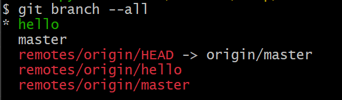
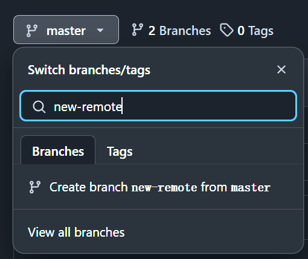
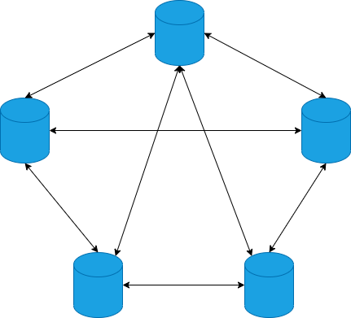
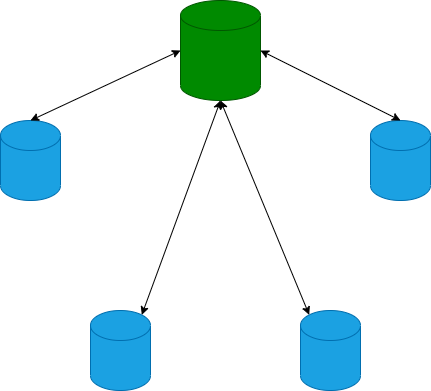

# 第九章 远程交互


之前的章节都是在本地机器上操作，但在实际开发中，往往会用一个公共的版本管理服务器，大家通过它分享代码，这个服务器经常被称为公共代码服务器。Git 本身能做到去中心化，但实际应用中，大多数时还是使用中心化方式，去中心化方式作为备份方案。本章选用 GitHub 作为远程服务器，讲解如何和远程交互。如何搭建服务器将在后续章节讲解。

本章提到的很多内容，都和前面的章节有关，但不是重复，前面章节回避了需要远程交互的内容，本章会一一补上。

## 1. 通过 GitHub 创建远程库

GitHub 不是 git，它是一个托管 git 项目的平台，所以叫 Git Hub. 公共的 git 仓库托管服务平台有很多，你也可以选择其他的，大同小异，无所谓。本文选 GitHub 是因为它是 VCS 托管平台中最流行的。

如果没有 GitHub 账号，请前往官方网站 <https://github.com> 注册。

注册后请将本机的 Public SSH Key 上传到 GitHub. SSH Key 的创建可以参考 [GitHub 的说明](https://docs.github.com/en/authentication/connecting-to-github-with-ssh/generating-a-new-ssh-key-and-adding-it-to-the-ssh-agent)。

1. 登录后点右上角头像 -> Settings -> SSH and GPG keys
2. 按页面提示添加 Public SSH Key，即你的公钥。

测试设置是否成功：

```plaintext
$ ssh -T git@github.com
Hi iridiumcao! You've successfully authenticated, but GitHub does not provide shell access.
```

### 1.1 创建

以上步骤完成后，就可以在 GitHub 平台创建一个远程的 Repo 了。

打开 <https://github.com/dashboard>


点击绿色的 New 按钮开始创建新库。


我这里创建了一个新的 repo: demo20231213

项目主页：<https://github.com/iridiumcao/demo20231213>


在项目主页上找到代码仓库的 SSH URL: git@github.com:iridiumcao/demo20231213.git

## 2. 在本地 clone 远程库

可以在任意目录执行以下指令将远程(GitHub)上的仓库 clone 到本地：

参考指令：`git clone {project url}`

实验记录：

```plaintext
$ git clone git@github.com:iridiumcao/demo20231213.git
Cloning into 'demo20231213'...
remote: Enumerating objects: 4, done.
remote: Counting objects: 100% (4/4), done.
remote: Compressing objects: 100% (4/4), done.
remote: Total 4 (delta 0), reused 0 (delta 0), pack-reused 0
Receiving objects: 100% (4/4), 12.52 KiB | 0 bytes/s, done.

$ cd demo20231213/
$ ls
LICENSE  README.md
```

## 3. 试用新库

创建一个新分支并 push 到远程：

```plaintext
$ git switch -c hello
Switched to a new branch 'hello'

$ git push origin hello
Total 0 (delta 0), reused 0 (delta 0), pack-reused 0
remote:
remote: Create a pull request for 'hello' on GitHub by visiting:
remote:      https://github.com/iridiumcao/demo20231213/pull/new/hello
remote:
To github.com:iridiumcao/demo20231213.git
 * [new branch]      hello -> hello
```

查看所有分支：

```plaintext
$ git branch --all
* hello
  master
  remotes/origin/HEAD -> origin/master
  remotes/origin/hello
  remotes/origin/master
```



分支 hello 在本地和远程都有了：

* 本地：hello
* 远程：remotes/origin/hello

Git 提示界面非常人性化，绿色的表示当前的本地分支，红色的表示远程分支。

## 4. 查看分支

查看分支用 `git branch`，它有一些参数可以调节输出结果。

不带参数，查看本地分支：

```plaintext
$ git branch
* hello
  master
```

`-v` 能查看到更详细的分支信息：分支名，最有一个 commit 的 id 和 message：

```
$ git branch -v
* hello  d804c28 hi, git!
  master a6f355c Initial commit
```

`-vv` 能查看到比 `-v` 更详细的分支信息，包括本地分支和远程分支的关联情况：

```plaintext
$ git branch -vv
* hello  d804c28 hi, git!
  master a6f355c [origin/master] Initial commit
```

`-r` 或 `--remote` 查看远程分支：

```plaintext
$ git branch -r
  origin/HEAD -> origin/master
  origin/hello
  origin/master
```

`-rv` 查看远程分支较详细的信息：

```plaintext
$ git branch -rv
  origin/HEAD   -> origin/master
  origin/hello  d804c28 hi, git!
  origin/master a6f355c Initial commit
```

`git branch -rv` 也可以写成 `git branch -r -v`

`-a` 或 `--all` 查看所有分支，包括本地和远程的(上一节也演示过)：

```plaintext
$ git branch --all
* hello
  master
  remotes/origin/HEAD -> origin/master
  remotes/origin/hello
  remotes/origin/master
```

## 5. 创建分支

本地库和远程库关联后，本地和远程的分支也可以关联起来，当然，关联是可以建立也可以取消的。

### 5.1 先本地再远程

参前面[3. 试用新库](#3)的内容，步骤就是：

1. 本地创建一个分支
2. 将这个新分支 push 到远程

注意，`push` 时如果要建立本地和远程分支的关联，需要使用 `-u` (`--set-upstream`) 参数。

```plaintext
$ git push --set-upstream origin main
```

### 5.2 先远程再本地

还可以先在远程库创建好分支后，再同步到本地。具体可以登录到 GitHub 的[项目主页](https://github.com/iridiumcao/demo20231213)，然后创建远程分支，假如新创建的分支是 new-remote.



远程创建的分支，本地必须先 `fetch` 到本地，才能继续。

先到任意分支执行 `git fetch --all` 以下载所有远程的变化：

```plaintext
$ git fetch --all
From github.com:iridiumcao/demo20231213
 * [new branch]      new-remote -> origin/new-remote
```

通过屏幕回显可知有远程一个新的分支 `origin/new-remote`，我们可以直接切换过去，就在本地创建了一个同名的分支，并且和远程自动关联起来了：

```plaintext
$ git switch new-remote
Switched to a new branch 'new-remote'
branch 'new-remote' set up to track 'origin/new-remote'.
```

## 6. 本地和远程交互

远程服务器的意义在于它是一个公共分享代码的地方，张三提交的代码，李四可以通过远程库获取，同样，李四提交的，张三也可以取到。

我们可以用两种方式模拟多人协作，假定只有张三和李四两个人。

* 第一种：用两台电脑模拟张三和李四的设备
* 第二种：安装两个虚拟机当张三和李四的
* 第三种：将远程代码 pull 到同一台机器的两个不同的文件夹。

我们这里采用第三种方式，最省事。

### 6.1 给张三和李四分别创建本地库

```plaintext
$ git clone git@github.com:iridiumcao/demo20231213.git demo_zhangsan
$ git clone git@github.com:iridiumcao/demo20231213.git demo_lisi
```

### 6.2 张三添加新改动，李四获取

张三 _(以下指令在张三的目录 demo_zhangsan 里执行)_

```plaintext
$ echo "morning, this is zhangsna." >> hello.txt
$ git status
$ git add .
$ git status
$ git commit -m "hello from zhangsan"
$ git status
$ git push origin master
```

为了节省篇幅，本文部分示例仅仅贴上指令，不粘贴屏幕回显内容。`git status` 可以随时用，用来观察仓库的状态，后面的例子中会不再贴这个指令，但读者一定要多用。

李四 _(以下指令在李四的目录 demo_lisi 里执行)_

```plaintext
$ git pull
remote: Enumerating objects: 4, done.
remote: Counting objects: 100% (4/4), done.
remote: Compressing objects: 100% (2/2), done.
remote: Total 3 (delta 0), reused 3 (delta 0), pack-reused 0
Unpacking objects: 100% (3/3), 316 bytes | 31.00 KiB/s, done.
From github.com:iridiumcao/demo20231213
   a6f355c..2e25383  master     -> origin/master
Updating a6f355c..2e25383
Fast-forward
 hello.txt | 1 +
 1 file changed, 1 insertion(+)
 create mode 100644 hello.txt
```

参上面的屏显提示，可以知道前面张三的改动李四已经获取到了。可以用 `git show` 查看最后一个 commit 以验证：

```plaintext
$ git show
commit 2e2538307881b345c8f9054924e922fb55b28da5 (HEAD -> master, origin/master, origin/HEAD)
Author: Cao Yi <iridiumcao@gmail.com>
Date:   Sun Dec 17 08:29:58 2023 +0800

    hello from zhangsan

diff --git a/hello.txt b/hello.txt
new file mode 100644
index 0000000..128dc6e
--- /dev/null
+++ b/hello.txt
@@ -0,0 +1 @@
+morning, this is zhangsna.
```

### 6.3 张三添加新分支，李四获取

张三 _(以下指令在张三的目录 demo_zhangsan 里执行)_

```plaintext
$ git switch -c new_branch_by_z3
Switched to a new branch 'new_branch_by_z3'

$ git push origin new_branch_by_z3
Total 0 (delta 0), reused 0 (delta 0), pack-reused 0
remote:
remote: Create a pull request for 'new_branch_by_z3' on GitHub by visiting:
remote:      https://github.com/iridiumcao/demo20231213/pull/new/new_branch_by_z3
remote:
To github.com:iridiumcao/demo20231213.git
 * [new branch]      new_branch_by_z3 -> new_branch_by_z3

```

李四 _(以下指令在李四的目录 demo_lisi 里执行)_

```plaintext
$ git pull
From github.com:iridiumcao/demo20231213
 * [new branch]      new_branch_by_z3 -> origin/new_branch_by_z3
Already up to date.

$ git checkout new_branch_by_z3
Switched to a new branch 'new_branch_by_z3'
branch 'new_branch_by_z3' set up to track 'origin/new_branch_by_z3'.

```

### 6.4 张三删除分支，李四获取

张三 _(以下指令在张三的目录 demo_zhangsan 里执行)_

```plaintext
$ git push origin --delete new_branch_by_z3
To github.com:iridiumcao/demo20231213.git
 - [deleted]         new_branch_by_z3
```

李四 _(以下指令在李四的目录 demo_lisi 里执行)_

```plaintext
$ git pull origin
Your configuration specifies to merge with the ref 'refs/heads/new_branch_by_z3'
from the remote, but no such ref was fetched.
```

从上面看到，远程的分支 `new_branch_by_z3` 已经获取不到了。清理一下本地对远程库的引用：

```plaintext
$ git remote prune origin
Pruning origin
URL: git@github.com:iridiumcao/demo20231213.git
 * [pruned] origin/new_branch_by_z3

```

### 6.5 冲突处理和强制推送说明

如果一个分支，张三和李四都在修改，他们对同一文件的做的修改可能冲突，这种情况，应该先解决冲突，慎用 `git push --force` 指令，带了 `--force` 参数的 `push` 将用当前用户的改动覆盖掉其他用户的改动，除非你确信要这么做，否则永远别用它。

### 6.6 小结

本地和远程的交互主要通过这三个指令：`fetch` / `pull` / `push`

* `git fetch` 获取远程的变化，但不改变工作区的 HEAD，比如当前分支有更新的化，`pull` 执行结束后，HEAD 不会指向最新的 commit
* `git pull` 从默认仓库的默认关联的仓库中拉取，会改变工作区的 HEAD，比如当前分支有更新的化，`pull` 执行结束后，HEAD 会指向最新的 commit
* `git pull origin develop` 从 origin 的 develop 分支拉取
* `git push` 最简单的推送命令，将推送到默认关联的分支上，但也只能在默认分支上执行。慎用 `--force` 参数
* `git push origin develop` 推送到指定的远程分支上
* `git push -u origin develop` 推送到指定的远程分支上，并关联本地当前的分支将和远程同名的分支

## 7. 关联远程分支

本地库要通过远程库分享代码，就需要把本地分支和远程的分支关联起来。

我们可以通过在 `pull` 或 `push` 时自动关联分支。需要注意，`push` 时需要加参数 `--set-upstream` (可简作 `-u`) 才能建立关联。

```plaintext
$ git push --set-upstream origin test5
$ git branch -vv
  main  c540eeb [origin/main] hello
  test2 c540eeb [origin/test2] hello
* test5 c540eeb [origin/test5] hello
```

查看到本地分支和远程分支的关联状态: `git branch -vv`。`git remote show origin` 可以更清楚查看本地分支和远程分支的关联状态(分 `git pull`, `git push` 两种情况分别显示)

还有一种情况，就是本地新建的分支，它是不会自动和远程某个分支关联的，可以通过指令设置，例如：

```plaintext
$ git branch --set-upstream-to=origin/test6
```

上面的指令会将当前分支和远程的 `origin/test6` 关联起来。如果要费当前分支的关联，可以加上本地的分支名：`git branch --set-upstream-to=origin/{remote branch name} {local branch name}`.

但其实不建立关联也不影响 `pull`, `push`，但建立关联有个好处是执行 `pull` 或 `push` 指令可以用简写模式。

如果要解除分支本地和远程的关联，可以在需要解除的分支上直接执行下面的指令即可，不需要带参数：

```plaintext
$ git branch --unset-upstream
```

## 8. 进阶篇

_进阶篇的内容在对 git 有一定使用经验后阅读更佳，初学者可以跳过。_

### 8.1 关联远程库

本地库要通过远程库分享代码，首先要将本地库和远程库关联起来。通过 `git clone` 操作建立的新库会自动将本地库和它 `clone` 的远程库关联起来。如：

```plaintext
$ git clone git@github.com:iridiumcao/demo20231213.git
$ cd demo20231213/
$ git remote -v
origin  git@github.com:iridiumcao/demo20231213.git (fetch)
origin  git@github.com:iridiumcao/demo20231213.git (push)
```

本地 git 库和远程 git 关联有两种方式：

1. 先建远程库，本地通过 clone，完成仓库的建立和关联，如上面例子所示。
2. 还有一种是先建本地库，再和远程库关联。下面示范讲解：

```plaintext
$ git init demo_another
$ cd demo_another/
$ git remote -v
```

上面的指令创建了一个空库 `demo_another`，通过 `git remote -v` 查看关联的远程库，是空的。下面我们添加远程库的链接：

```plaintext
$ git remote add origin git@github.com:iridiumcao/demo20231213.git
$ git remote -v
origin  git@github.com:iridiumcao/demo20231213.git (fetch)
origin  git@github.com:iridiumcao/demo20231213.git (push)
```

远程库如果只有一个，约定俗成的名称是 `origin`，当然也可以起其他名称。

### 8.2 再谈关联分支

本地库和远程库的关联情况可用不同的指令获取，`git remote show origin` 的输出分 `pull` 和 `push` 显示，内容比 `git branch -vv` 更加详细，例如

```plaintext
$ git remote show origin
* remote origin
  Fetch URL: ...
  Push  URL: ...
  HEAD branch: main
  Remote branches:
    main  tracked
    test2 tracked
    ...
  Local branches configured for 'git pull':
    main  merges with remote main
    test3 merges with remote test4
    ...
  Local refs configured for 'git push':
    main  pushes to main  (up to date)
    test2 pushes to test2 (up to date)
    ...
```

* `git branch --set-upstream-to=origin/{remote branch name}` 将当前的本地分支的 push 和远程的 `origin/{remote branch name}` 关联起来
* `git checkout -b {local branch name} -t origin/{remote branch name}` 创建一个新分支并将 pull 和 push 都与远程的分支关联起来了
  * 这条指令的 `-t` (`--track`) 标记可以省略：`git branch -b {local branch name} origin/{remote branch name}`

参：

* <http://serverfault.com/questions/175052/how-to-tell-which-local-branch-is-tracking-which-remote-branch-in-git>
* <http://stackoverflow.com/questions/4950725/how-do-i-get-git-to-show-me-which-branches-are-tracking-what>

### 8.3 再谈 fetch/pull

平常工作中，用 `pull` 多 `fetch`，但这两个指令是非常相关的。

#### 8.3.1 `fetch`

通过 `git fetch` 可以获取远程的变化

* `git fetch --all` 获取远程所有的变化，如果关联多个远程库，则所有的远程库的变化都会 fetch 到。
* `git fetch origin test2` 获取远程库 origin 的分支 test2 变化

执行上述指令后，如果当前分支在远程有新的变化，执行 `git status` 时屏幕会提示用户执行 `git pull` 去更新。

用图说明如下：

更新前：

```plaintext
                        HEAD
                         /
    o---o---o---o---o---o  a branch
  root
```

更新后(执行 `git fetch`)：

```plaintext
                        HEAD
                         /
    o---o---o---o---o---o---o---o  a branch
  root
```

可见，即使有新的改动，`fetch` 只是把新的改动放到 Repository 而已，不会改变 Working Directory 的任何东西。

#### 8.3.2 `pull`

直观上看，`pull` 与 `fetch` 最大的不同是库更新后，它会调整 `HEAD` 到最新的版本上。

更新前：

```plaintext
                        HEAD
                         /
    o---o---o---o---o---o  a branch
  root
```

更新后(执行 `git pull`)：

```plaintext
                                HEAD
                                 /
    o---o---o---o---o---o---o---o  a branch
  root
```

`pull` 指令实际上一个合成指令，它有两种模式：

* `pull = fetch + merge` 将远程的变化 `fetch` 到，然后合并到本地分支
* `pull = fetch + rebase` 将远程的变化 `fetch` 到，然后对远程的变化做 `rebase`.

这个模式可以通过配置 `$ git config pull.rebase` 调节，比如

```plaintext
$ git config pull.rebase true
```

默认值是 `false`.

如果不考虑默认值，但在 `pull` 时要使用 `rebase` 方式，可以使用指令 `git pull --rebase`，如：

```plaintext
$ git pull origin test2 --rebase
```

其他。新增一个文件，但不执行 `git add`, 可以在 git repo 上执行 `git pull` 而无碍。

其他。从本地推送分支，如果失败，先用 `git pull` 抓取远程的新提交再重新 `push`.

扩展阅读：[`pull`'s configuration](https://iridiumcao.github.io/git/pull_setting.html)

### 8.4 批量处理多个分支

有些指令会影响到多个分支，这里举一些例子：

获取全部变化(包括分支和标签)

```plaintext
$ git fetch --all
```

删除多个 branch

```plaintext
$ git branch -D helloworld001 helloworld002 helloworld003
```

推送多个 branch 到远程

```plaintext
$ git push origin helloworld001 helloworld002 helloworld003
$ git push origin refs/heads/helloworld001 refs/heads/helloworld002 refs/heads/helloworld003
```

删除多个远程 branch

```plaintext
$ git push origin --delete helloworld001 helloworld002 helloworld003
$ git push origin refs/heads/helloworld001 refs/heads/helloworld002 refs/heads/helloworld003
```

删除多个 tag

```plaintext
$ git tag --delete test_tag1 test_tag2 test_tag3
```

推送多个远程 tag

```plaintext
$ git push origin test_tag1 test_tag2 test_tag3
$ git push origin refs/tags/test_tag1 refs/tags/test_tag2 refs/heads/test_tag3
```

删除多个远程 tag

```plaintext
$ git push origin --delete test_tag1 test_tag2 test_tag3
$ git push origin --delete refs/tags/test_tag1 refs/tags/test_tag2 refs/heads/test_tag3
```

`refs/tags/test_tag1` 是 `test_tag1` 的完整名称，`refs/heads/helloworld001` 是 `helloworld001` 的完整名称，一般情况下，我们使用简称就够了，但有时 branch 和 tag 同名，就必须使用完整名称。

### 8.5 `git branch --merged`

一个 commit 可能存在多个 branch 上，可以通过 `git branch --merged {commit hash}` 找到，例如

```plaintext
$ git branch --merged c540eeb
  main
  test2
* test5
  test6
```

上面找到了所有包含 c540eeb 的分支。这个指令可以和远程指令结合起来用，如果不跟 commit hash, 就表示查本分支包含哪些分支的全部内容，例如：

```plaintext
$ git checkout master
$ git pull origin master
$ git branch -r --merged
  origin/helloworld001
  origin/helloworld003
  origin/helloworld005
  origin/master
```

它是说在远程库中，这三个分支都已经合并到 master 了：`helloworld001`, `helloworld002` and `helloworld003`.

相关的指令还有 `git branch -r --no-merged`，可自行探索，这里不再展开。

### 8.6 Git 网络拓扑结构

Git 是去中心化的，它的节点可以网状方式连接，如：



但一般的开发团队还是选用中心化网络结构：



其实这么选择还是有道理的，如果中心化服务器坏掉，数据并不会丢，我们再选一个其他正常的节点做为新的中心就好了。
